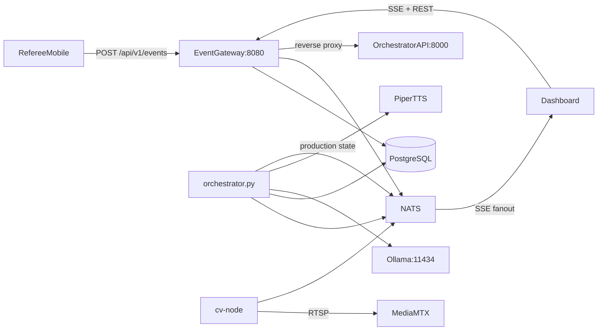

# Architecture

**One-liner:** LAN-first baseball game-day automation from referee input to live production output.

## Why it exists

Dugout.ai replaces a multi-person broadcast crew with a single manager supervising automated music, graphics, commentary, and alerts. The architecture separates **authoritative game state** (referee events) from **enrichment** (CV jersey detection) and keeps slow AI paths off the latency-critical event route.

## How it works

1. The **referee mobile app** posts official `GameEvent` protobuf-JSON to the **event-gateway** at `POST /api/v1/events`.
2. The gateway persists the event to PostgreSQL (`game_events`), publishes to NATS (`dugout.game.{gameId}.events`), and applies the Go **reducer** to maintain live state.
3. The **dashboard** opens an SSE connection (`GET /api/v1/games/stream`) and receives replayed history plus live frames for game state, music, graphics, commentary, and command status.
4. The **ai-orchestrator daemon** (`orchestrator.py`) subscribes to game events and CV observations on NATS.
5. On each game event, the daemon enqueues production commands (scoreboard update, batter/pitcher intro overlays) via `CommandQueue`, and fires commentary generation asynchronously via `CommentaryEngine`.
6. On CV observations below 70% confidence, walk-up music commands are enqueued with `requires_confirmation=True`; the manager approves via the dashboard.
7. **cv-node** reads an RTSP stream from MediaMTX, detects jersey numbers, and publishes to `dugout.game.{gameId}.observations`.
8. Production adapters (`MusicAdapter`, `GraphicsAdapter`) execute commands and publish state back to NATS; the gateway fans those out over SSE.

## Architecture diagram

## Key code callouts

| File                                                                                                      | What it does                                                                    |
| --------------------------------------------------------------------------------------------------------- | ------------------------------------------------------------------------------- |
| `[services/event-gateway/cmd/main.go](../services/event-gateway/cmd/main.go)`                             | Wires HTTP routes, NATS, Postgres, and reverse-proxy to orchestrator            |
| `[services/event-gateway/internal/server/server.go](../services/event-gateway/internal/server/server.go)` | `IngestEvent`, `SSEStream`, NATS subscribers, in-memory game-state cache        |
| `[services/ai-orchestrator/orchestrator.py](../services/ai-orchestrator/orchestrator.py)`                 | `OrchestratorDaemon` — NATS event handlers, command enqueue, CV confidence gate |
| `[services/ai-orchestrator/command_queue.py](../services/ai-orchestrator/command_queue.py)`               | Priority queue with cooldowns, conflict groups, manager approval                |

## Tech stack

| Technology                           | Reason                                                                             |
| ------------------------------------ | ---------------------------------------------------------------------------------- |
| **Go (event-gateway)**               | Fast HTTP ingest, SSE fan-out, protobuf validation on critical path                |
| **Python/FastAPI (ai-orchestrator)** | Rapid iteration on production adapters, LLM/TTS integration                        |
| **NATS**                             | Decoupled pub/sub between gateway, orchestrator, and cv-node without blocking HTTP |
| **PostgreSQL**                       | Append-only event log, roster/media metadata, command queue persistence            |
| **Protobuf contracts**               | Shared typed events across Go, Python, and TypeScript clients                      |
| **Ollama + Piper**                   | Local LLM/TTS for commentary without cloud latency or cost                         |
| **MediaMTX**                         | RTSP test stream for cv-node pilot without real cameras                            |
| **React + Expo**                     | Manager dashboard and referee mobile app on shared event contracts                 |

## Talking points

- Referee app is the **authoritative source** for official game state in v1 — CV is enrichment only.
- Commentary runs **off the critical path** via `asyncio.create_task` so referee-to-dashboard latency stays under 250 ms.
- **Append-only events** enable replay after service restarts — no mutable game-state table.
- **Command queue** with priority, cooldowns, and conflict groups prevents music/overlay collisions.
- Low-confidence CV (< 70%) creates a **manager approval gate** before walk-up music plays.
- NATS + async Python tasks handle background work.

