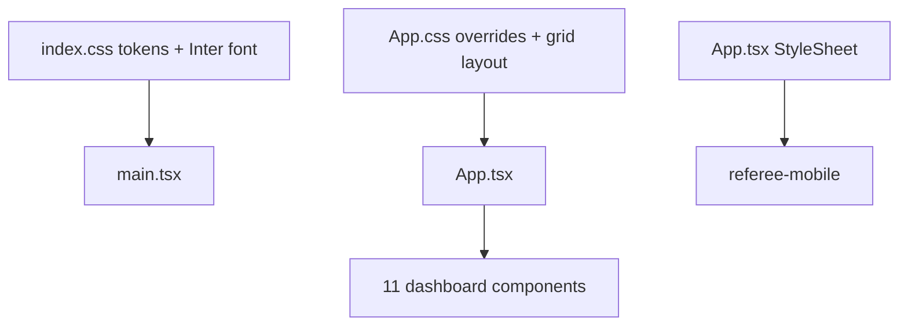

# Color Theme

**One-liner:** Dark navy control-center palette with gold accents and Inter typography.

## Why it exists

The dashboard and referee app share a **Command Center Dark** aesthetic so operators can read dense live data under stadium lighting. Gold/amber accents draw attention to live status and primary actions without the distraction of a bright UI.

## How it works

1. The dashboard loads `[apps/dashboard/src/index.css](../apps/dashboard/src/index.css)` in `main.tsx` for global tokens and Google Fonts.
2. `[apps/dashboard/src/App.css](../apps/dashboard/src/App.css)` redefines overlapping `:root` variables and applies the 3-column grid layout — **App.css wins** for shared tokens due to load order.
3. Component-specific styles (cards, scoreboard, buttons) use CSS classes in `App.css` referencing the custom properties.
4. The referee mobile app mirrors the palette via inline `StyleSheet.create` values in `[apps/referee-mobile/App.tsx](../apps/referee-mobile/App.tsx)`.
5. all styling is hand-written CSS variables and React Native StyleSheet.

## Theme token reference

### Dashboard — `index.css` (base layer)

| Token              | Hex       | Usage                      |
| ------------------ | --------- | -------------------------- |
| `--bg-primary`     | `#0a0e1a` | Page background            |
| `--bg-secondary`   | `#111827` | Header, secondary surfaces |
| `--bg-card`        | `#1e1e2e` | Card backgrounds           |
| `--border-color`   | `#2d2d44` | Card borders               |
| `--border-light`   | `#374151` | Subtle dividers            |
| `--text-primary`   | `#e5e7eb` | Body text                  |
| `--text-secondary` | `#9ca3af` | Labels, secondary text     |
| `--text-muted`     | `#6b7280` | De-emphasized text         |
| `--accent-gold`    | `#f59e0b` | Primary accent, titles     |
| `--accent-amber`   | `#fbbf24` | Highlights                 |
| `--accent-indigo`  | `#818cf8` | Inning indicator           |
| `--accent-green`   | `#34d399` | Live/success states        |
| `--accent-red`     | `#ef4444` | Emergency stop, errors     |
| `--accent-blue`    | `#60a5fa` | Interactive elements       |
| `--accent-purple`  | `#a78bfa` | Secondary highlights       |
| `--alert-bg`       | `#7f1d1d` | Alert panel background     |
| `--alert-border`   | `#dc2626` | Alert borders              |
| `--success-bg`     | `#064e3b` | Success panel background   |
| `--success-border` | `#059669` | Success borders            |

### Dashboard — `App.css` (overrides)

| Token             | Hex                     | Notes                                                 |
| ----------------- | ----------------------- | ----------------------------------------------------- |
| `--bg-main`       | `#0c0f12`               | Body background (replaces `--bg-primary`)             |
| `--bg-card`       | `rgba(22, 28, 36, 0.7)` | Glassmorphism cards with `backdrop-filter: blur(8px)` |
| `--bg-secondary`  | `#131920`               | Header bar                                            |
| `--accent-blue`   | `#3b82f6`               | Overrides index.css blue                              |
| `--accent-green`  | `#10b981`               | Live badge, overrides index.css green                 |
| `--accent-gold`   | `#fbbf24`               | Swapped with amber vs index.css                       |
| `--accent-purple` | `#8b5cf6`               | Overrides index.css purple                            |
| `--accent-indigo` | `#6366f1`               | Overrides index.css indigo                            |

### Typography

| Font               | Weights       | Where                                                                          |
| ------------------ | ------------- | ------------------------------------------------------------------------------ |
| **Inter**          | 400–900       | Primary UI font via Google Fonts import in `index.css`                         |
| **JetBrains Mono** | 400, 500, 700 | Scoreboard counts, progress bars, monospace data                               |
| **Outfit**         | —             | Listed in `App.css` `font-family` but **never imported** — falls back to Inter |

Heading sizes: `.main-header h1` at 18px/800 weight; card headers at 14px/700.

### Referee mobile — inline StyleSheet

| Usage           | Hex                  |
| --------------- | -------------------- |
| Background      | `#0a0e1a`            |
| Header / inputs | `#111827`, `#1f2937` |
| Cards           | `#1e1e2e`            |
| Title / accent  | `#f59e0b`, `#fbbf24` |
| Inning          | `#818cf8`            |
| Ball button     | `#1d4ed8`            |
| Strike button   | `#dc2626`            |
| Hit buttons     | `#059669`            |

### Animations and effects

- `.btn-emergency-stop:hover` — `transform: scale(1.05)` with red box-shadow pulse
- `.live-badge.live` — green tinted background `rgba(16, 185, 129, 0.15)` with border
- Card styling — `border-radius: 12px`, `backdrop-filter: blur(8px)` on glass cards
- Music fade-out — JavaScript interval decrements `Audio.volume` by 0.2 every 200ms in `App.tsx`

## Architecture diagram

## Key code callouts

- `[apps/dashboard/src/index.css](../apps/dashboard/src/index.css)` — `:root` token definitions and font imports
- `[apps/dashboard/src/App.css](../apps/dashboard/src/App.css)` — `.dashboard-grid`, `.card`, `.btn-emergency-stop`, `.live-badge`
- `[apps/referee-mobile/App.tsx](../apps/referee-mobile/App.tsx)` — `StyleSheet.create` at bottom of file

## Tech decisions

1. **CSS custom properties over Tailwind** — keeps the dashboard dependency-free and allows glassmorphism via `backdrop-filter` without a build plugin.
2. **Gold/amber accent on near-black base** — high contrast for stadium operator visibility without full white backgrounds.
3. **Duplicate `:root` blocks** — known tech debt; `App.css` overrides `index.css` for several tokens. Consolidation is a future cleanup item.

## Talking points

- Design intent is **Command Center Dark**, not the electric-orange/Syne theme from unrelated RAG projects.
- Inter + JetBrains Mono pairing gives readable UI text and precise monospace for B/S/O counts.
- Referee app uses system fonts with matching hex values — no custom font loading on mobile.
- Several component class names in TSX (e.g. `music-control-card`) lack dedicated CSS rules and fall back to generic `.card` styling.

