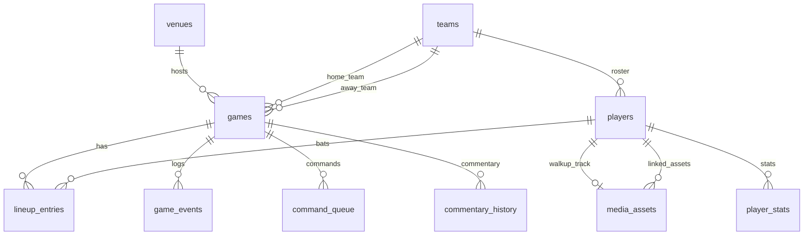

# Database

**One-liner:** PostgreSQL stores events, rosters, media, commands, and commentary history.

## Why it exists

All production decisions must be traceable. PostgreSQL provides relational integrity for rosters/lineups, JSONB flexibility for event payloads, and indexed queries for replay and command queue processing. Commentary context comes from direct SQL lookups.

## How it works

Migrations live in `[infra/db/migrations/](../infra/db/migrations/)`. Apply `000001` then `000002`, then seed with `[infra/db/seeds_phase3.sql](../infra/db/seeds_phase3.sql)`.

### Core tables (000001)

| Table                 | Purpose                         | Key columns                                                |
| --------------------- | ------------------------------- | ---------------------------------------------------------- |
| `venues`              | Stadium metadata                | `id`, `name`, `location`                                   |
| `teams`               | Team info + colors              | `id`, `name`, `primary_color`, `logo_url`                  |
| `media_assets`        | Walk-up audio, graphics         | `id`, `type`, `file_path`, `metadata` JSONB                |
| `players`             | Roster players                  | `id`, `team_id`, `jersey_number`, `walkup_track_id`        |
| `games`               | Game records                    | `id`, `venue_id`, `home_team_id`, `away_team_id`, `status` |
| `lineup_entries`      | Batting order                   | PK: `(game_id, team_id, player_id)`, `batting_order`       |
| `game_events`         | **Append-only official events** | `event_id` PK, `payload` JSONB, `sequence`                 |
| `cv_observations`     | CV log (schema only)            | `observation_id`, `confidence`, `model_name`               |
| `production_commands` | Legacy command table            | Superseded by `command_queue`                              |
| `audit_logs`          | Audit trail (schema only)       | No active write path yet                                   |

### Phase 3 extensions (000002)

| Table                | Purpose                               | Key columns                                              |
| -------------------- | ------------------------------------- | -------------------------------------------------------- |
| `player_stats`       | Batting/pitching stats for commentary | `player_id`, `batting_avg`, `era`, `stat_type`           |
| `graphics_templates` | Overlay template definitions          | `template_type`, `layout_config` JSONB                   |
| `commentary_history` | LLM/TTS audit trail                   | `text`, `source`, `context_snapshot` JSONB, `audio_path` |
| `command_queue`      | Full command lifecycle                | `priority`, `conflict_group`, `cooldown_until`, `status` |
| `roster_uploads`     | CSV upload tracking                   | `team_id`, `file_name`, `player_count`                   |

**ALTERs:** `teams` (+logo_path, banner_path), `players` (+headshot_path, bat_hand), `media_assets` (+player_id, duration_ms, tags).

### Entity-relationship diagram

### Indexes

| Index                            | Table                | Columns                    |
| -------------------------------- | -------------------- | -------------------------- |
| `idx_game_events_game_id`        | `game_events`        | `game_id`                  |
| `idx_game_events_sequence`       | `game_events`        | `(game_id, sequence)`      |
| `idx_command_queue_status`       | `command_queue`      | `status`                   |
| `idx_command_queue_conflict`     | `command_queue`      | `(conflict_group, status)` |
| `idx_commentary_history_game_id` | `commentary_history` | `game_id`                  |
| `idx_player_stats_player_id`     | `player_stats`       | `player_id`                |
| `idx_media_assets_type`          | `media_assets`       | `type`                     |

Payload queries use JSONB columns without GIN indexes currently.

### Media asset conventions

| Type          | Path pattern                              | Format      |
| ------------- | ----------------------------------------- | ----------- |
| Walk-up audio | `media/audio/walkup/{player_id}.wav`      | WAV/MP3     |
| Headshots     | `media/images/headshots/{player_id}.png`  | PNG 400×400 |
| Team logos    | `media/images/team-logos/{team_id}.png`   | PNG 200×200 |
| Fallback      | `media/audio/fallback/default_walkup.wav` | WAV         |
| Effects       | `media/audio/effects/*.wav`               | WAV         |

## Key code callouts

- `[infra/db/migrations/000001_init_schema.up.sql](../infra/db/migrations/000001_init_schema.up.sql)` — core schema
- `[infra/db/migrations/000002_phase3_schema.up.sql](../infra/db/migrations/000002_phase3_schema.up.sql)` — production automation tables
- `[services/ai-orchestrator/db_client.py](../services/ai-orchestrator/db_client.py)` — asyncpg queries for all orchestrator DB access
- `[services/event-gateway/internal/db/db.go](../services/event-gateway/internal/db/db.go)` — event ingest and replay only

## Tech decisions

1. **JSONB event payloads** — flexible event types without schema migrations per new payload field.
2. `**command_queue` over `production_commands`** — priority, cooldowns, conflict groups, and approval workflow require richer columns.
3. **No Redis** — hot game state lives in gateway memory; command queue polls Postgres.

## Talking points

- `seeds_phase3.sql` comment references `seeds.sql` which does not exist — only phase3 seed is in repo.
- `cv_observations` and `audit_logs` are schema-ready but not wired to services.
- Commentary `context_snapshot` JSONB preserves exactly what stats/state were used for each LLM call.
- Pilot game ID: `game_2026_ashland_vs_opponent` with Ashland vs Opponent rosters.

