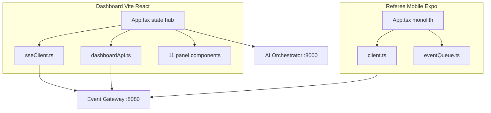

# Frontend

**One-liner:** Two single-screen apps - manager dashboard and referee event emitter.

## Why it exists

Production staff need different interfaces: the **manager** supervises all systems in a dense control center, while the **referee** needs large, unambiguous buttons for fast official event input during live play.

## How it works

### Dashboard (`apps/dashboard`)

1. **Stack:** React 19 + TypeScript + Vite 8. Entry: `index.html` → `main.tsx` → `App.tsx`.
2. **No router** — single full-screen 3-column grid layout.
3. **Data:** SSE push via `connectSSE()` in `sseClient.ts`; REST actions via `dashboardApi.ts`.
4. **Layout:** Left (music, override), Center (camera, scoreboard, lineup), Right (commentary, stats, alerts, status, timeline).
5. **Audio:** Browser `Audio` API in `App.tsx` plays music and commentary files from orchestrator static mount.

### Referee mobile (`apps/referee-mobile`)

1. **Stack:** Expo 56 + React Native 0.85. Entry: `index.ts` → `App.tsx`.
2. **No router** — single scrollable screen with correction modal.
3. **Data:** POST-only to gateway via `client.ts`; offline queue in `eventQueue.ts`.
4. **Sections:** Scoreboard, pitch buttons, play outcome buttons, inning control, correction modal, server URL config.

## Architecture diagram

## Key code callouts

| File                                                                                        | Role                                               |
| ------------------------------------------------------------------------------------------- | -------------------------------------------------- |
| `[apps/dashboard/src/App.tsx](../apps/dashboard/src/App.tsx)`                               | Central state hub, SSE handler, audio playback     |
| `[apps/dashboard/src/api/sseClient.ts](../apps/dashboard/src/api/sseClient.ts)`             | `EventSource` connection, frame type parsing       |
| `[apps/dashboard/src/api/dashboardApi.ts](../apps/dashboard/src/api/dashboardApi.ts)`       | REST helpers (music, commentary, commands, lineup) |
| `[apps/referee-mobile/App.tsx](../apps/referee-mobile/App.tsx)`                             | All UI + optimistic local state                    |
| `[apps/referee-mobile/src/api/client.ts](../apps/referee-mobile/src/api/client.ts)`         | `sendEvent()` POST to gateway                      |
| `[apps/referee-mobile/src/api/eventQueue.ts](../apps/referee-mobile/src/api/eventQueue.ts)` | In-memory offline FIFO queue                       |

## Tech decisions

1. **No React Router** - v1 is single-game pilot; one screen per role is sufficient.
2. **No state management library** - `useState` in `App.tsx` handles all state; SSE provides live updates without polling.
3. **Gateway as API hub** - dashboard talks to port 8080 for both SSE and proxied REST; orchestrator port 8000 used only for static media files.

## Talking points

- Dashboard uses **SSE not WebSocket** despite `env.template` referencing `ws://localhost:8080/ws`.
- `getMediaAssets()` and `uploadMediaAsset()` in `dashboardApi.ts` are exported but never called.
- Referee app updates local state optimistically before/alongside API send.
- Game ID hardcoded as `game_2026_ashland_vs_opponent` in both apps.
- See `[docs/frontend/COMPONENT_TREE.md](frontend/COMPONENT_TREE.md)`, `[STATE_MANAGEMENT.md](frontend/STATE_MANAGEMENT.md)`, `[DATA_FLOW.md](frontend/DATA_FLOW.md)` for detail.

