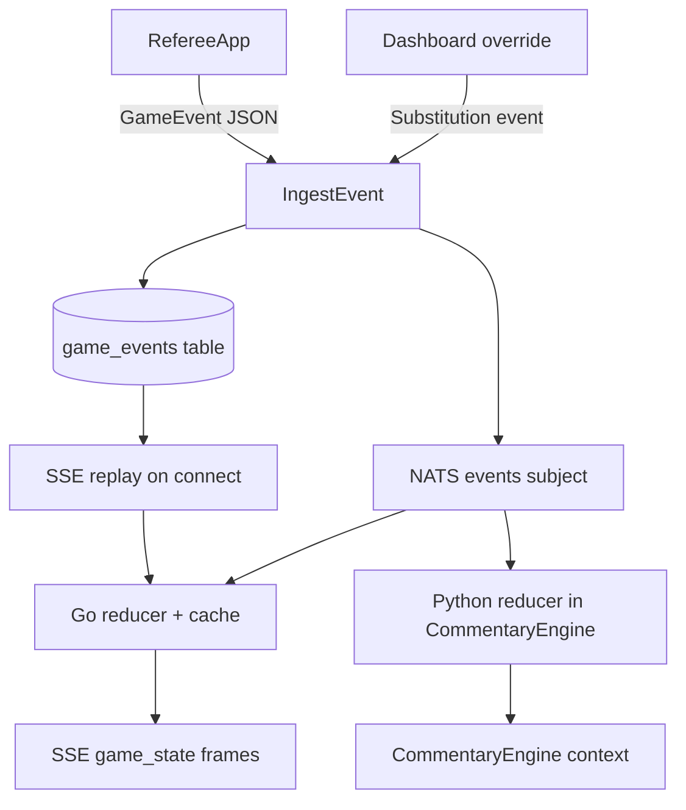

# Game State and Events

**One-liner:** Append-only event log rebuilt into live game state via pure reducers.

## Why it exists

Baseball game state (count, inning, bases, score) must be **reconstructable from events** after network drops or service restarts. Mutable state tables would lose audit history. Correction events append fixes rather than silently mutating prior records.

## How it works

1. **Referee or manager** submits a `GameEvent` (protobuf JSON) to `POST /api/v1/events`.
2. **Gateway** (`IngestEvent` in `server.go`) enriches with `receivedAt`, writes to `game_events` table, publishes to NATS.
3. **Go reducer** (`reducer.Reduce` in `reducer.go`) clones state, applies payload by type:
   - `PitchResult` — balls, strikes, walks, strikeouts
   - `PlayOutcome` — hits, outs, runs, base advancement
   - `InningTransition` — inning/half changes
   - `Substitution` — player swaps on bases and active roles
   - `ClockControl` — game clock start/stop/reset
   - `Correction` — explicit override of count/score
4. **In-memory cache** (`Server.games` map) holds current state per game ID; rebuilt from DB replay on cache miss via `loadOrCreateGameState`.
5. **SSE replay** — on connect, gateway fetches all events ordered by `sequence`, reduces each, sends historical frames before subscribing to live NATS updates.
6. **Python duplicate reducer** — `CommentaryEngine.update_game_state_from_event` in `commentary_engine.py` maintains a separate in-memory `_game_states` dict for commentary context (known duplication with Go reducer).

### Event contract fields

Defined in [`packages/contracts/proto/dugout/v1/game_event.proto`](../packages/contracts/proto/dugout/v1/game_event.proto):

- `eventId`, `gameId`, `source`, `sourceDeviceId`
- `occurredAt`, `receivedAt`, `sequence`
- `confidence`, `authority`, `correlationId`
- Payload oneof: `pitchResult`, `playOutcome`, `inningTransition`, `substitution`, `clockControl`, `correction`, `manualOverride`

### Context window / memory strategy

There is **no LLM conversation memory**. Context for commentary is built per-event from:
- In-memory reduced game state (`_game_states` dict)
- Direct Postgres lookups for player stats and roster (`db_client.py`)
- Last N commentary lines from `commentary_history` table

No truncation, summarization, or sliding window — each commentary call gets fresh SQL-fetched stats plus current state snapshot stored in `context_snapshot` JSONB.

## Architecture diagram

## Key code callouts

| Function | File | Role |
|----------|------|------|
| `Reduce()` | `services/event-gateway/internal/reducer/reducer.go` | Canonical Go game-state reducer |
| `SaveGameEvent()` / `GetGameEvents()` | `services/event-gateway/internal/db/db.go` | Append-only persistence and ordered replay |
| `SSEStream()` | `services/event-gateway/internal/server/server.go` | Replay + live broadcast |
| `update_game_state_from_event()` | `services/ai-orchestrator/commentary_engine.py` | Python mirror reducer for commentary |
| `get_or_create_game_state()` | `services/ai-orchestrator/commentary_engine.py` | Per-game in-memory state dict |

## Tech decisions

1. **Append-only `game_events`** — enables full replay; corrections are explicit `Correction` events, not UPDATEs.
2. **Protobuf contracts** — typed payloads shared across Go gateway, Python orchestrator, and TypeScript clients.
3. **Dual reducers (Go + Python)** — commentary daemon needs local state without round-tripping through gateway; consolidation is planned but both must stay in sync today.

## Talking points

- Official events have `authority: "official"` from referee; manager overrides use `authority: "manager"`.
- Sequence ordering (`ORDER BY sequence ASC, occurred_at ASC`) ensures deterministic replay.
- `cv_observations` table exists in schema but observations flow NATS-only today — not persisted.
- `audit_logs` table exists but has no active write path in services yet.
