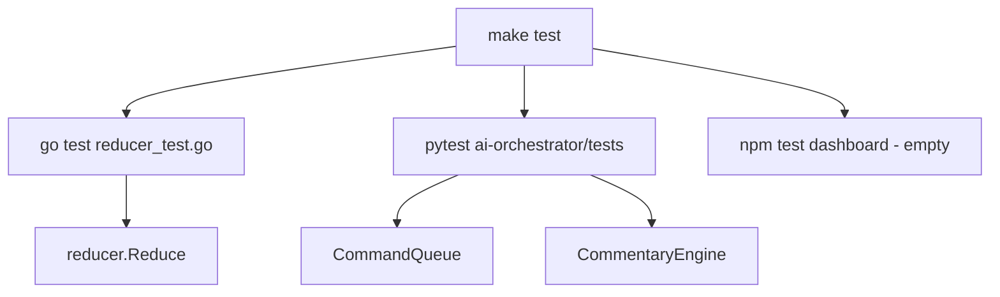

# Testing

**One-liner:** Unit tests cover game-state reducer and orchestrator command/commentary logic.

## Why it exists

Game-state correctness and command queue behavior are safety-critical — wrong count or overlapping music commands would break a live broadcast. Tests lock down reducer rules and queue priority before UI or field pilots depend on them.

## How it works

Run the full suite via `[Makefile](../Makefile)` `test` target:

```bash
make test
```

This executes:

1. **Go tests** — `go test ./... -v` in `services/event-gateway`
2. **Python tests** — `pytest services/ai-orchestrator/tests/`
3. **Dashboard tests** — `npm run test --workspace=apps/dashboard` (no tests exist yet)

### Unit tests — Go reducer

**File:** `[services/event-gateway/internal/reducer/reducer_test.go](../services/event-gateway/internal/reducer/reducer_test.go)`


| Test                          | Covers                                             |
| ----------------------------- | -------------------------------------------------- |
| `TestReduce_PitchBall`        | Ball count, 4-ball walk, count reset               |
| `TestReduce_Strikeout`        | Strike accumulation, 3-strike K, out increment     |
| `TestReduce_Foul`             | Foul as strike only when strikes < 2               |
| `TestReduce_PlayOutcome`      | Singles, doubles, HR run scoring, base advancement |
| `TestReduce_InningTransition` | Inning/half change, base clear                     |
| `TestReduce_Correction`       | Explicit count/score override                      |
| `TestReduce_Substitution`     | Batter/pitcher/base runner replacement             |


Uses inline fixture events

### Unit tests — Python command queue

**File:** `[services/ai-orchestrator/tests/test_command_queue.py](../services/ai-orchestrator/tests/test_command_queue.py)`


| Test                                       | Covers                                                |
| ------------------------------------------ | ----------------------------------------------------- |
| `test_command_queue_priority_and_cooldown` | Highest-priority command executes first via mocked DB |
| `test_command_queue_cancellation`          | Cancel command updates status                         |


Uses `AsyncMock` for DB and NATS.

### Unit tests — Python commentary

**File:** `[services/ai-orchestrator/tests/test_commentary.py](../services/ai-orchestrator/tests/test_commentary.py)`


| Test                            | Covers                                                                                  |
| ------------------------------- | --------------------------------------------------------------------------------------- |
| `test_commentary_state_updates` | `CommentaryEngine.update_game_state_from_event` — balls, strikes, active batter/pitcher |


Mocks `OllamaClient` and `TTSClient`

## Test coverage gaps


| Layer                            | Status                   |
| -------------------------------- | ------------------------ |
| Dashboard (React)                | **No tests**             |
| Referee mobile (Expo)            | **No tests**             |
| cv-node                          | **No tests**             |
| Event gateway HTTP/SSE           | **No integration tests** |
| AI orchestrator API routes       | **No integration tests** |
| End-to-end (referee → dashboard) | **No E2E tests**         |
| NATS messaging                   | **Not tested**           |
| DB migrations                    | **Not tested**           |


## Architecture diagram




## Key code callouts

- `[services/event-gateway/internal/reducer/reducer_test.go](../services/event-gateway/internal/reducer/reducer_test.go)` — most comprehensive test file
- `[services/ai-orchestrator/tests/test_command_queue.py](../services/ai-orchestrator/tests/test_command_queue.py)` — queue priority mock test
- `[services/ai-orchestrator/tests/test_commentary.py](../services/ai-orchestrator/tests/test_commentary.py)` — Python reducer parity check

## Tech decisions

1. **Reducer tests before UI** — follows project implementation order; game-state correctness is foundational.
2. **Mock-based Python tests** — fast CI without requiring Postgres/NATS/Ollama running.
3. **No E2E yet** — pilot validation is manual via `make infra-up` + service startup.

## Talking points

- Honest gap: **no frontend tests** despite 11 dashboard components.
- Reducer has good pitch/play/inning coverage but no test for `ClockControl` or `ManualOverride`.
- `make test` gracefully echoes "No tests" for missing dashboard test folder.
- Integration scenario tests listed in `CLAUDE.md` (network reconnect, duplicate events, emergency stop) are **not yet implemented**.

