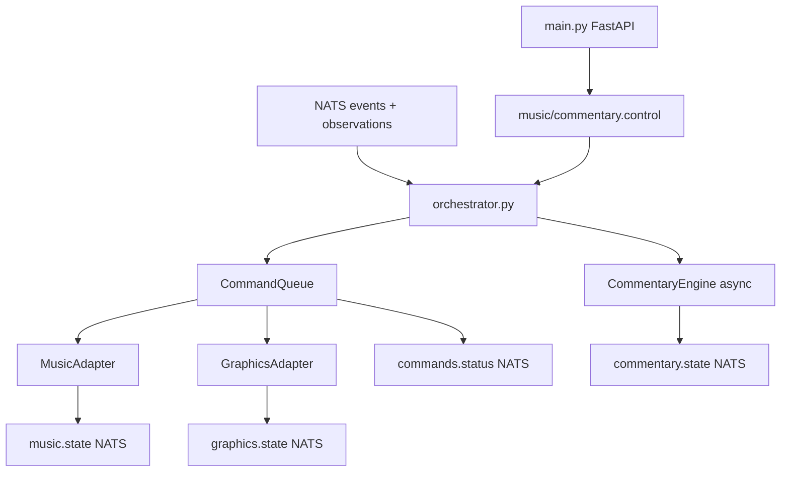

# AI Orchestrator

**One-liner:** Python service automating music, graphics, and commentary from game events.

## Why it exists

Production automation (walk-up music, scoreboard overlays, AI commentary) requires async processing, database lookups, and adapter boundaries. Python provides fast iteration on these adapters while keeping them off the Go gateway's critical path.

## How it works

The orchestrator runs as **two processes**:

### Process 1: FastAPI API (`main.py`)

- REST endpoints for roster, media, lineup, player stats, command management, override, music/commentary control
- Publishes control messages to NATS (`dugout.production.music.control`, `dugout.production.commentary.control`)
- Serves static media files at `/media`
- Player override posts substitution event back through gateway at `http://localhost:8080/api/v1/events`

### Process 2: Daemon (`orchestrator.py`)

1. **Initialize** adapters: `CommandQueue`, `MusicAdapter`, `GraphicsAdapter`, `CommentaryEngine`
2. **Register handlers**: `music_adapter` and `graphics_adapter` with command queue
3. **Start** command queue processing loop
4. **Subscribe** to NATS:
   - `dugout.game.*.events` → `handle_game_event`
   - `dugout.game.*.observations` → `handle_cv_observation`
   - `dugout.production.music.control` → `handle_music_control`
   - `dugout.production.commentary.control` → `handle_commentary_control`

### Game event handling

On each event in `handle_game_event`:
1. Snapshot state before via `commentary_engine.get_or_create_game_state`
2. Fire `asyncio.create_task(commentary_engine.generate_commentary)` — off critical path
3. Get state after event applied
4. Enqueue `update_scoreboard` command (priority 3) to graphics adapter
5. If batter changed → enqueue `show_batter_intro` (priority 4)
6. If pitcher changed → enqueue `show_pitcher_intro` (priority 4)

### CV observation handling

On each observation in `handle_cv_observation`:
1. Resolve player by jersey via `db.get_player_by_jersey`
2. If confidence < `CV_CONFIDENCE_THRESHOLD` (0.70): enqueue `play_walkup_music` with `requires_confirmation=True`
3. If confidence >= threshold: enqueue `play_walkup_music` directly

### Command queue (`command_queue.py`)

| Feature | Implementation |
|---------|---------------|
| Priority | Lower number = higher priority (1=stop, 5=walk-up) |
| Cooldowns | `DEFAULT_COOLDOWNS` dict per command type |
| Conflict groups | `CONFLICT_GROUPS` — new command supersedes older in same group |
| Approval gate | `requires_confirmation` → `pending_approval` status |
| Emergency stop | `emergency_stop()` cancels all queued commands |
| Status reporting | Publishes to `dugout.commands.status` on NATS |

### Music adapter (`music_adapter.py`)

Handles `play_walkup_music`, `stop_music`, `fade_out_music`. Resolves walk-up asset via `MediaManager`, publishes state to `dugout.production.music.state`.

### Graphics adapter (`graphics_adapter.py`)

Handles `update_scoreboard`, `show_batter_intro`, `show_pitcher_intro`, `hide_overlay`. Publishes to `dugout.production.graphics.state`.

## Architecture diagram

## Key code callouts

| Class/Function | File |
|----------------|------|
| `OrchestratorDaemon` | `services/ai-orchestrator/orchestrator.py` |
| `CommandQueue.enqueue()` | `services/ai-orchestrator/command_queue.py` |
| `MusicAdapter.handle_command()` | `services/ai-orchestrator/music_adapter.py` |
| `GraphicsAdapter.handle_command()` | `services/ai-orchestrator/graphics_adapter.py` |
| `MediaManager.get_walkup_track()` | `services/ai-orchestrator/media_manager.py` |

## Tech decisions

1. **Asyncio task queue over Celery** — single-machine pilot; NATS + asyncio sufficient for workload.
2. **Command queue in Postgres** — survives daemon restart; status visible to dashboard via SSE.
3. **Separate API and daemon** — HTTP requests don't block NATS event processing.

## Talking points

- Commentary is always `asyncio.create_task` — never blocks game event processing.
- Manual music control from dashboard publishes to NATS control subject, handled by daemon.
- `override_player` API creates a substitution event and posts to gateway — flows through same event pipeline.
- See [`COMMENTARY_PIPELINE.md`](COMMENTARY_PIPELINE.md) for LLM/TTS detail.
