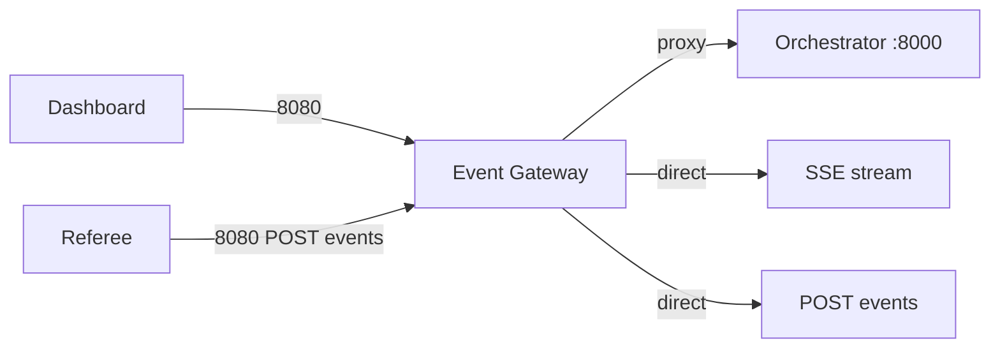

# API Routes

**One-liner:** REST endpoints on gateway :8080 and orchestrator :8000.

## Why it exists

Clients need stable HTTP contracts for event ingest, live streaming, roster management, production control, and command approval. The gateway exposes ingest + SSE directly; orchestrator REST is proxied through gateway for dashboard convenience.

## How it works

**Auth:** None implemented. `env.template` has JWT placeholders but no middleware enforces them.

**Rate limiting:** None.

### Event Gateway (port 8080) — direct handlers

| Method | Path | Handler | Request | Response |
|--------|------|---------|---------|----------|
| GET | `/health` | inline | — | `{"status":"healthy","service":"event-gateway"}` |
| POST | `/api/v1/events` | `IngestEvent` | Protobuf-JSON `GameEvent` | `201 {"status":"created","event_id":"..."}` |
| GET | `/api/v1/games/stream` | `SSEStream` | Query: `game_id` | SSE stream of typed frames |

### Event Gateway — proxied to orchestrator

These routes reverse-proxy to `AI_ORCHESTRATOR_URL` (default `http://localhost:8000`):

| Path prefix | Methods |
|-------------|---------|
| `/api/v1/override` | POST |
| `/api/v1/music/control` | POST |
| `/api/v1/commentary/control` | POST |
| `/api/v1/commands/` | GET, POST |
| `/api/v1/lineup` | GET |
| `/api/v1/players/` | GET |
| `/api/v1/media` | GET, POST |
| `/api/v1/media/` | GET, POST, DELETE |
| `/api/v1/roster` | GET, POST |
| `/api/v1/roster/` | GET, POST |

### AI Orchestrator (port 8000) — full route table

#### Health

| Method | Path | Returns |
|--------|------|---------|
| GET | `/health` | Service status, version, contracts_loaded |

#### Games and lineup

| Method | Path | Query params | Returns |
|--------|------|-------------|---------|
| GET | `/api/v1/games/{game_id}` | — | Game details with teams |
| GET | `/api/v1/lineup` | `game_id`, `team_id` | Ordered batting lineup |
| GET | `/api/v1/lineup/next-batters` | `game_id`, `team_id`, `current_index`, `count` | Next N batters |
| GET | `/api/v1/roster` | `game_id` | Full roster for all teams |

#### Players

| Method | Path | Query params | Returns |
|--------|------|-------------|---------|
| GET | `/api/v1/players/{player_id}` | — | Player details |
| GET | `/api/v1/players/{player_id}/stats` | `stat_type` (default: season) | Batting/pitching stats |
| GET | `/api/v1/players/by-jersey/{jersey_number}` | `game_id`, `team_side` | Player by jersey |

#### Override

| Method | Path | Body | Returns |
|--------|------|------|---------|
| POST | `/api/v1/override` | `{game_id, jersey_number, team_side?, reason?}` | Override applied + player/stats/walkup |

#### Roster upload

| Method | Path | Body | Returns |
|--------|------|------|---------|
| POST | `/api/v1/roster/upload` | `{team_id, players[]}` | Upsert count |
| POST | `/api/v1/roster/upload-csv` | Form: `team_id`, `file` | CSV parse + upsert count |

#### Media

| Method | Path | Params | Returns |
|--------|------|--------|---------|
| GET | `/api/v1/media` | `asset_type?`, `player_id?` | Asset list |
| GET | `/api/v1/media/{asset_id}` | — | Single asset + file_exists |
| POST | `/api/v1/media/upload` | Form: name, type, file, etc. | Uploaded asset |
| DELETE | `/api/v1/media/{asset_id}` | — | Deletion status |
| GET | `/api/v1/media/validate/{game_id}` | — | Validation report |

#### Templates

| Method | Path | Returns |
|--------|------|---------|
| GET | `/api/v1/templates` | All graphics templates |
| GET | `/api/v1/templates/{template_type}` | Single template |

**Not proxied through gateway** — only reachable on orchestrator :8000 directly.

#### Commands

| Method | Path | Body | Returns |
|--------|------|------|---------|
| GET | `/api/v1/commands` | Query: `game_id`, `target?` | Active queued commands |
| POST | `/api/v1/commands/{command_id}` | `{action: "approve"\|"cancel", reason?}` | Approval/cancel status |

#### Production control

| Method | Path | Body | Effect |
|--------|------|------|--------|
| POST | `/api/v1/music/control` | `{game_id, action, player_id?, asset_id?, fade_ms?}` | Publishes to NATS music control |
| POST | `/api/v1/commentary/control` | `{game_id, action, text?}` | Publishes to NATS commentary control |

Actions: music = `play`, `stop`, `fade_out`, `emergency_stop`; commentary = `mute`, `unmute`, `regenerate`, `manual`.

#### Static files

| Method | Path | Returns |
|--------|------|---------|
| GET | `/media/*` | Static media files from `MEDIA_BASE_PATH` |

### SSE frame types

Delivered on `GET /api/v1/games/stream`:

| Frame type | Content |
|------------|---------|
| `game_state` | `{event, state}` — official event + reduced state |
| `music_state` | Music playback status |
| `graphics_state` | Active overlay + scoreboard data |
| `commentary_state` | Commentary text, audio path, source |
| `command_status` | Command lifecycle updates |

## Architecture diagram

## Key code callouts

- [`services/event-gateway/cmd/main.go`](../services/event-gateway/cmd/main.go) — route registration and proxy setup
- [`services/ai-orchestrator/main.py`](../services/ai-orchestrator/main.py) — all FastAPI route handlers
- [`apps/dashboard/src/api/dashboardApi.ts`](../apps/dashboard/src/api/dashboardApi.ts) — dashboard REST client
- [`apps/referee-mobile/src/api/client.ts`](../apps/referee-mobile/src/api/client.ts) — referee `sendEvent()`

## Tech decisions

1. **Gateway as single client port** — dashboard uses 8080 for everything except direct orchestrator media URLs.
2. **Protobuf-JSON for events** — `protojson` marshal/unmarshal in Go gateway.
3. **NATS for control plane** — music/commentary control endpoints publish to NATS, not direct adapter calls.

## Talking points

- `EVENT_GATEWAY_WS_URL` in env.template references WebSocket that does not exist — SSE is the real-time transport.
- Override endpoint hardcodes gateway URL `http://localhost:8080` in orchestrator code.
- CORS is `allow_origins=["*"]` on orchestrator — fine for pilot, needs tightening for production.
