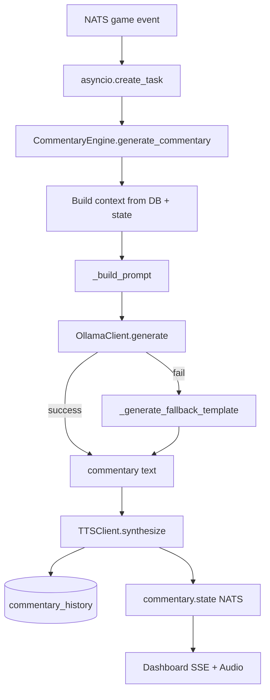

# Commentary Pipeline

**One-liner:** Ollama LLM generates play-by-play text; Piper TTS speaks it.

## Why it exists

Live commentary for online audiences must not block official game-state updates. A separate async pipeline generates short play-by-play lines from verified stats and state, with template fallback when Ollama is offline.

## How it works

Triggered by `asyncio.create_task(commentary_engine.generate_commentary())` in `orchestrator.py` on every game event.

1. **Update state** — `get_or_create_game_state()` + `update_game_state_from_event()`
2. **Publish status** — NATS `dugout.production.commentary.state` with `status: "generating"`
3. **Build context** — snapshot of scoreboard state, event payload, batter/pitcher names and stats from Postgres
4. **Construct prompt** — `_build_prompt()` with player names, stats, count, inning, event type
5. **LLM call** — `OllamaClient.generate(prompt, SYSTEM_PROMPT, model="llama3.2:1b")`
   - Health check via `check_health()` → `GET http://localhost:11434/`
   - Generate via `POST /api/generate` with temperature 0.7, top_p 0.9
   - On failure or empty response → `_generate_fallback_template()`
6. **TTS synthesis** — `TTSClient.synthesize()` writes WAV to `media/audio/commentary/commentary_{eventId}.wav`
   - Piper model `en_US-lessac-medium` downloaded from HuggingFace on first use
7. **Persist** — `db.save_commentary()` to `commentary_history` with `context_snapshot` JSONB
8. **Publish** — commentary state to NATS with text, audio path, source (`llm` | `template` | `manual`)

### System prompt

```
You are a professional, formal baseball radio broadcast announcer.
Keep commentary concise (1 to 2 sentences max).
Do not invent any facts or players not mentioned in the context.
```

### Provider routing

**Single provider only** — local Ollama at `http://localhost:11434`. No multi-provider routing, no Vertex/OpenAI/Anthropic failover, no RAG retrieval.

| Step | Provider | Fallback |
|------|----------|----------|
| Text generation | Ollama `llama3.2:1b` | Template strings in `_generate_fallback_template()` |
| Speech synthesis | Piper `en_US-lessac-medium` | Skip audio, text-only commentary |

### Manual controls

Via `POST /api/v1/commentary/control` → NATS `dugout.production.commentary.control`:

| Action | Effect |
|--------|--------|
| `mute` | `commentary_engine.set_muted(True)` |
| `unmute` | `commentary_engine.set_muted(False)` |
| `manual` | `speak_manual(game_id, text)` — TTS only, no LLM |
| `regenerate` | Re-run `generate_commentary` with dummy event |

## Architecture diagram



## Key code callouts

| Function | File |
|----------|------|
| `generate_commentary()` | `services/ai-orchestrator/commentary_engine.py` |
| `OllamaClient.generate()` | `services/ai-orchestrator/llm_client.py` |
| `TTSClient.synthesize()` | `services/ai-orchestrator/tts_client.py` |
| `SYSTEM_PROMPT` | `services/ai-orchestrator/commentary_engine.py` |

## Tech decisions

1. **Local Ollama over cloud LLM** — zero network latency, no API cost, runs on stadium edge server.
2. **Template fallback** — commentary never fails silently; operators always get text even without GPU/LLM.
3. **Async off critical path** — `asyncio.create_task` ensures referee event processing is not blocked.

## Talking points

- No RAG, no vector search — context is direct SQL lookups for player stats.
- `piper` package not in `requirements.txt` — known setup gap.
- Commentary audio played in dashboard via `new Audio(orchestratorUrl + audioPath)` in `App.tsx`.
- `commentary_history.context_snapshot` preserves exact stats used — good audit trail for interview.
