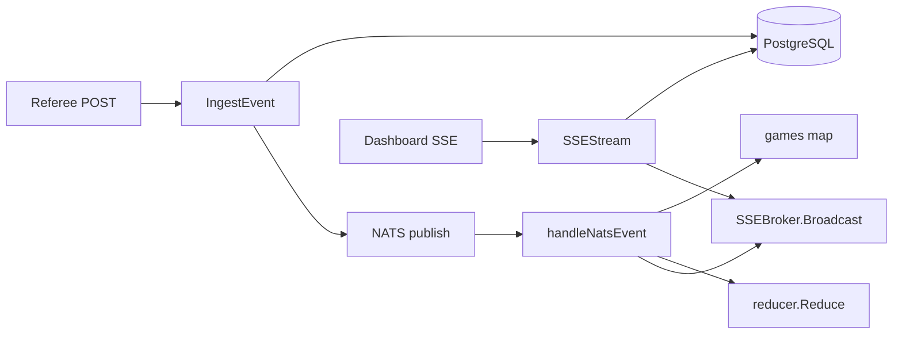

# Event Gateway

**One-liner:** Go HTTP service that ingests events, replays state, and fans out SSE.

## Why it exists

Referee events must reach the dashboard in under 250 ms on LAN. A small, fast Go service handles validation, persistence, sequencing, and fan-out without LLM or TTS in the path.

## How it works

1. **Startup** (`cmd/main.go`): Connect to NATS (5 retries), Postgres (5 retries), create `Server`, subscribe to NATS subjects, register HTTP routes.
2. **Ingest** (`IngestEvent`):
   - Accept protobuf-JSON `GameEvent` at `POST /api/v1/events`
   - Set `receivedAt` server-side
   - `SaveGameEvent()` → Postgres `game_events`
   - Publish to `dugout.game.{gameId}.events` on NATS
   - Return `201` with event ID
3. **SSE stream** (`SSEStream`):
   - `GET /api/v1/games/stream?game_id=`
   - Fetch all events from DB, reduce each via `reducer.Reduce`
   - Send historical frames via `SSEBroker.ServeHTTPWithInitial`
   - Register client for live NATS broadcasts
4. **NATS handlers** (`handleNatsEvent`, etc.):
   - Game events → reduce → broadcast `game_state` frame
   - Music/graphics/commentary/command status → wrap and broadcast typed frames
5. **Reverse-proxy**: Phase 3 REST routes proxied to `AI_ORCHESTRATOR_URL` (default `http://localhost:8000`)
6. **In-memory cache**: `Server.games` map with `sync.RWMutex`; rebuilt from DB on miss

### NATS subscriptions

| Subject | Handler |
|---------|---------|
| `dugout.game.*.events` | `handleNatsEvent` |
| `dugout.production.music.state` | `handleMusicState` |
| `dugout.production.graphics.state` | `handleGraphicsState` |
| `dugout.production.commentary.state` | `handleCommentaryState` |
| `dugout.commands.status` | `handleCommandStatus` |

## Architecture diagram

## Key code callouts

| Function | File |
|----------|------|
| `IngestEvent()` | `services/event-gateway/internal/server/server.go` |
| `SSEStream()` | `services/event-gateway/internal/server/server.go` |
| `Reduce()` | `services/event-gateway/internal/reducer/reducer.go` |
| `ServeHTTPWithInitial()` | `services/event-gateway/internal/server/sse.go` |
| `SaveGameEvent()` | `services/event-gateway/internal/db/db.go` |

## Tech decisions

1. **Go for gateway** — low-allocation HTTP + protobuf on the critical path.
2. **SSE over WebSocket** — simpler replay semantics; one-directional push is sufficient for dashboard.
3. **NATS failure tolerance** — ingest returns 201 even if NATS publish fails (DB is source of truth).

## Talking points

- No auth middleware on any endpoint despite JWT placeholders in `env.template`.
- SSE broker uses non-blocking send (`select/default`) to avoid slow clients blocking broadcast.
- Proxy routes cover override, music, commentary, commands, lineup, players, media, roster — but not `/api/v1/games/{id}` or `/api/v1/templates`.
