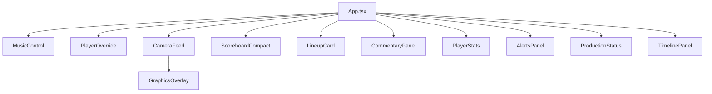

# Component Tree

**One-liner:** Dashboard has 11 panels; referee app is one monolithic screen.

## Why it exists

The manager needs all production systems visible simultaneously. The component tree maps each panel's data dependencies and user interactions for interview walkthrough.

## How it works

### Dashboard hierarchy

```
App.tsx (state hub)
├── header (inline)
│   ├── title + live-badge
│   └── btn-emergency-stop
└── dashboard-grid
    ├── col-left
    │   ├── MusicControl
    │   └── PlayerOverride
    ├── col-center
    │   ├── CameraFeed
    │   │   └── GraphicsOverlay
    │   └── horizontal-panel-row
    │       ├── ScoreboardCompact
    │       └── LineupCard
    └── col-right
        ├── CommentaryPanel
        ├── PlayerStats
        ├── AlertsPanel
        ├── ProductionStatus
        └── TimelinePanel
```

### Dashboard components

| Component | Data props | Renders | User interactions |
|-----------|-----------|---------|-------------------|
| `MusicControl` | `musicState`, `gameId`, `nextBatters` | Now-playing track, progress bar, next batters list | Stop, fade-out, manual play via `controlMusic()` |
| `PlayerOverride` | `gameId` | Jersey number input form | Submit override → `overridePlayer()` |
| `CameraFeed` | `graphicsState` | Video player (WHEP/file/URL) + overlay controls | Source switch, play/pause, hide overlay |
| `GraphicsOverlay` | `graphicsState` | Batter/pitcher intro, lower-third, speed display | Read-only overlay on video |
| `ScoreboardCompact` | `gameState` | B/S/O, scores, inning, base diamond | Read-only |
| `LineupCard` | `gameId`, `activeBatterId` | Home/away lineup tabs, roster list | Tab switch, CSV roster upload |
| `CommentaryPanel` | `commentaryState`, `gameId` | Commentary log, current text | Mute, regenerate, manual speak |
| `PlayerStats` | `activeBatterId`, `activePitcherId` | Batter vs pitcher matchup stats | Fetches via `getPlayer()` + `getPlayerStats()` |
| `AlertsPanel` | `alerts`, `pendingCommands` | CV alerts, command approval gate | Confirm/override alerts, approve/cancel commands |
| `ProductionStatus` | hardware booleans | Service health indicators | Read-only status lights |
| `TimelinePanel` | `timeline` | Recent 50 events | Read-only scrollable log |

### Reusable primitives

No shared component library. Styling uses generic `.card`, `.btn-*` classes from `App.css`. Each component is a self-contained panel.

### Referee mobile hierarchy

```
App.tsx (monolith — no sub-components)
├── Header (title, last action, pending queue badge)
├── Server URL config (TextInput)
├── Scoreboard (balls, strikes, outs, inning, scores)
├── Pitch buttons (ball, strike looking, strike swinging, foul)
├── Play outcome buttons (out, single, double, triple, HR, walk)
├── Game controls (next half inning)
└── Correction modal (Modal)
```

Referee sections are inline `View`/`TouchableOpacity` blocks in `App.tsx` — no `src/components/` folder.

## Architecture diagram



## Key code callouts

- [`apps/dashboard/src/App.tsx`](../apps/dashboard/src/App.tsx) — component wiring and prop passing
- [`apps/dashboard/src/components/CameraFeed.tsx`](../apps/dashboard/src/components/CameraFeed.tsx) — embeds `GraphicsOverlay`
- [`apps/referee-mobile/App.tsx`](../apps/referee-mobile/App.tsx) — entire referee UI in one file

## Tech decisions

1. **Flat component folder** — no nested routes or layout components; v1 pilot simplicity.
2. **Props-down from App.tsx** — all live state originates from SSE handler in parent.
3. **Self-fetching components** — `PlayerStats`, `LineupCard` fetch their own REST data on mount/effect.

## Talking points

- All 11 dashboard components are wired — none orphaned.
- Several TSX class names lack dedicated CSS rules and fall back to `.card`.
- Referee app has unused `Alert` import from react-native.
- `GraphicsOverlay` is the only nested child component.
