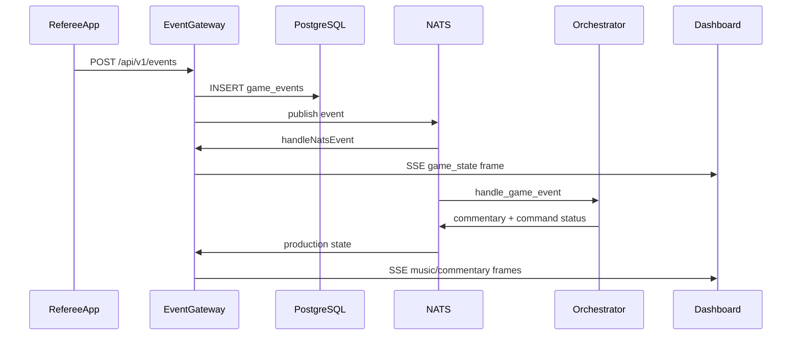

# Data Flow

**One-liner:** Two end-to-end traces — referee event input and manager command approval.

## Why it exists

Concrete sequences showing how user actions propagate through UI, API, messaging, and back to the dashboard.

## How it works

### Flow 1: Referee taps "Ball" → dashboard updates

1. **Referee** taps Ball button in `[apps/referee-mobile/App.tsx](../apps/referee-mobile/App.tsx)` `handlePitch('BALL')`.
2. Local `gameState.balls` incremented optimistically via `setGameState`.
3. `submitEvent()` calls `sendEvent()` in `[client.ts](../apps/referee-mobile/src/api/client.ts)`.
4. `POST http://localhost:8080/api/v1/events` with protobuf-JSON payload:
  - `eventId`, `gameId`, `source: "referee_app"`, `sequence`, `pitchResult: {result: "BALL", ...}`
5. **Event gateway** `IngestEvent()` in `[server.go](../services/event-gateway/internal/server/server.go)`:
  - Sets `receivedAt`, saves to `game_events` table
  - Publishes to NATS `dugout.game.{gameId}.events`
6. **Gateway NATS handler** `handleNatsEvent()`:
  - Loads/creates game state from cache or DB replay
  - `reducer.Reduce(state, event)` — balls incremented
  - Broadcasts SSE frame `{type: "game_state", event, state}` via `SSEBroker`
7. **Orchestrator daemon** `handle_game_event()` in `[orchestrator.py](../services/ai-orchestrator/orchestrator.py)`:
  - `asyncio.create_task(commentary_engine.generate_commentary())` — async
  - Enqueues `update_scoreboard` command to `CommandQueue`
8. **Dashboard** `handleFrame()` in `[App.tsx](../apps/dashboard/src/App.tsx)`:
  - `setGameState(frame.state)` — balls count updates in UI
  - Appends timeline entry "Pitch: BALL"
  - `fetchNextBatters()` via REST if needed
9. **ScoreboardCompact** re-renders with new ball count.
10. **Commentary** (async, seconds later): Ollama generates text → Piper TTS → NATS `commentary.state` → dashboard `setCommentaryState` → audio plays.

### Flow 2: Low-confidence CV → manager approves walk-up music

1. **cv-node** detects jersey with confidence 0.63 in `[main.py](../services/cv-node/main.py)`.
2. Publishes observation to NATS `dugout.game.{gameId}.observations`.
3. **Orchestrator** `handle_cv_observation()`:
  - Confidence 0.63 < threshold 0.70
  - Resolves player by jersey from Postgres
  - `cmd_queue.enqueue(play_walkup_music, requires_confirmation=True)`
4. **CommandQueue** persists to `command_queue` table with `status: pending_approval`.
5. Publishes to NATS `dugout.commands.status`.
6. **Gateway** `handleCommandStatus()` wraps as `{type: "command_status", data}` → SSE broadcast.
7. **Dashboard** `handleFrame()`:
  - Adds to `pendingCommands` array
  - Creates `AlertItem` with type `low_cv_confidence`
8. **AlertsPanel** renders approval buttons.
9. **Manager** clicks "Confirm" → `handleApproveCommand(cmdId)`.
10. `approveCommand()` → `POST /api/v1/commands/{cmdId}` with `{action: "approve"}`.
11. **Orchestrator API** `db.approve_command()` updates status.
12. **CommandQueue** processor picks up approved command → `MusicAdapter.handle_command()`.
13. **MusicAdapter** resolves walk-up asset, publishes `music.state` to NATS.
14. **Gateway** → SSE → dashboard `setMusicState` → `App.tsx` audio effect plays walk-up WAV.

### Error handling

| Scenario            | Behavior                                                                     |
| ------------------- | ---------------------------------------------------------------------------- |
| Referee offline     | `enqueueEvent()` → `pendingCount` badge; `flushQueue()` on reconnect         |
| SSE disconnect      | `connected` → false, live badge shows "OFFLINE"                              |
| REST failure        | `console.error` in catch blocks; no retry UI                                 |
| Ollama offline      | Template fallback commentary; `source: "template"`                           |
| NATS down at ingest | Event saved to DB (201 returned); live broadcast delayed until NATS recovers |

## Architecture diagram

## Key code callouts

| Step           | Function                  | File                                               |
| -------------- | ------------------------- | -------------------------------------------------- |
| Referee send   | `sendEvent()`             | `apps/referee-mobile/src/api/client.ts`            |
| Gateway ingest | `IngestEvent()`           | `services/event-gateway/internal/server/server.go` |
| SSE receive    | `handleFrame()`           | `apps/dashboard/src/App.tsx`                       |
| CV gate        | `handle_cv_observation()` | `services/ai-orchestrator/orchestrator.py`         |
| Approve        | `approveCommand()`        | `apps/dashboard/src/api/dashboardApi.ts`           |

## Tech decisions

1. **Append-only events** — referee POST is the single write path for official state; no dashboard direct state mutation.
2. **SSE for all live updates** — one connection handles game state, music, graphics, commentary, and commands.
3. **Approval gate on command queue** — low-confidence actions require explicit manager confirm before music adapter executes.

## Talking points

- Referee optimistic state may briefly diverge from dashboard authoritative state until SSE frame arrives.
- Emergency stop: `controlMusic(gameId, 'emergency_stop')` → NATS → `cmd_queue.emergency_stop()` cancels all queued commands.
- `handleHideOverlay` in App.tsx posts to music control endpoint (not graphics) — known quirk.
- Total referee-to-dashboard latency target: under 250 ms on LAN (per CLAUDE.md).

