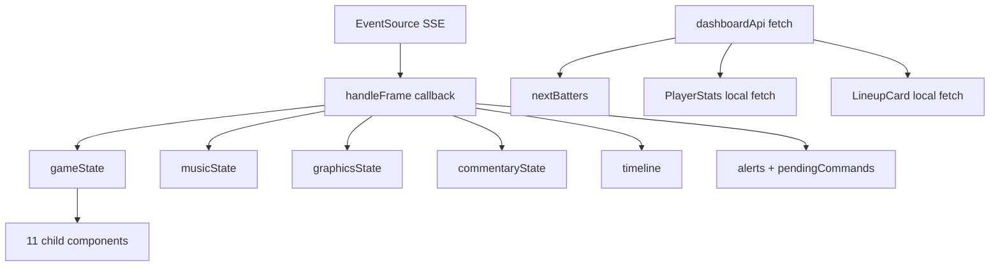

# State Management

**One-liner:** React useState hubs in both apps — no Redux, Zustand, or React Query.

## Why it exists

v1 pilot has a single game and single screen per app. Local React state with SSE push eliminates the complexity of global stores or caching libraries.

## How it works

### Dashboard state (`App.tsx`)

All state via `useState`:

| State variable | Type | Source | Updated by |
|----------------|------|--------|------------|
| `gameState` | `GameState` | SSE `game_state` frames | `handleFrame` |
| `musicState` | `MusicState` | SSE `music_state` frames | `handleFrame` |
| `graphicsState` | `GraphicsState` | SSE `graphics_state` frames | `handleFrame` |
| `commentaryState` | `CommentaryState` | SSE `commentary_state` frames | `handleFrame` |
| `timeline` | `TimelineEntry[]` | Derived from SSE game events | `handleFrame` (max 50) |
| `alerts` | `AlertItem[]` | Derived from `command_status` pending_approval | `handleFrame`, `handleResolveAlert` |
| `pendingCommands` | `any[]` | SSE `command_status` frames | `handleFrame`, approve/cancel handlers |
| `nextBatters` | `any[]` | REST `getLineup()` | `fetchNextBatters` on game state change |
| `connected` | `boolean` | SSE connection health | `handleFrame` (true), `onError` (false) |

**Refs (not state):**
- `musicAudioRef` — browser `Audio` element for walk-up music
- `commentaryAudioRef` — browser `Audio` for commentary WAV
- `lastMusicUrlRef` / `lastCommentaryUrlRef` — prevent duplicate audio loads

**No global store.** No Context providers. No React Query or SWR.

### Referee mobile state (`App.tsx`)

| State variable | Type | Updated by |
|----------------|------|------------|
| `gameState` | local `GameState` (balls, strikes, outs, inning, scores) | Optimistic update on button press |
| `showCorrection` | `boolean` | Correction modal toggle |
| `correctionBalls/Strikes/Outs/Home/Away/Reason` | strings | Modal form inputs |
| `pendingCount` | `number` | Offline queue length |
| `lastAction` | `string` | Last event send result |
| `serverUrl` | `string` | Gateway URL config |

**Offline queue** (`eventQueue.ts`):
- Module-level `let queue: GameEventPayload[]` — in-memory FIFO
- `enqueueEvent()` on send failure
- `flushQueue()` on next successful send
- `clearQueue()` exported but never called

### Server state pattern

Dashboard does **not** cache REST responses. Components that need data fetch on mount:

| Component | Fetch | Trigger |
|-----------|-------|---------|
| `PlayerStats` | `getPlayer()`, `getPlayerStats()` | `useEffect` on `activeBatterId`/`activePitcherId` change |
| `LineupCard` | `getLineup()` | `useEffect` on tab/gameId change |
| `App.tsx` | `getLineup()` for next batters | `fetchNextBatters` on every game state SSE frame |

Live data is **SSE-driven**; REST is fire-and-forget for actions.

## Architecture diagram

## Key code callouts

- [`apps/dashboard/src/App.tsx`](../apps/dashboard/src/App.tsx) — all `useState` declarations and `handleFrame`
- [`apps/dashboard/src/api/sseClient.ts`](../apps/dashboard/src/api/sseClient.ts) — SSE type definitions
- [`apps/referee-mobile/src/api/eventQueue.ts`](../apps/referee-mobile/src/api/eventQueue.ts) — offline queue module state

## Tech decisions

1. **SSE as primary data transport** — eliminates polling and cache invalidation complexity.
2. **Optimistic referee state** — local count updates immediately for referee UX; authoritative state comes from gateway reducer via dashboard SSE.
3. **No React Query** — single-game pilot doesn't need cache keys or stale-while-revalidate.

## Talking points

- Dashboard and gateway maintain **separate** game states — dashboard gets authoritative state via SSE, referee has local optimistic copy.
- `pendingCommands` typed as `any[]` — could be tightened to `CommandStatus[]`.
- Audio state managed via refs + effects, not React state — avoids re-render on every audio tick.
- No Zustand/Redux/Context — intentional for v1 scope.
